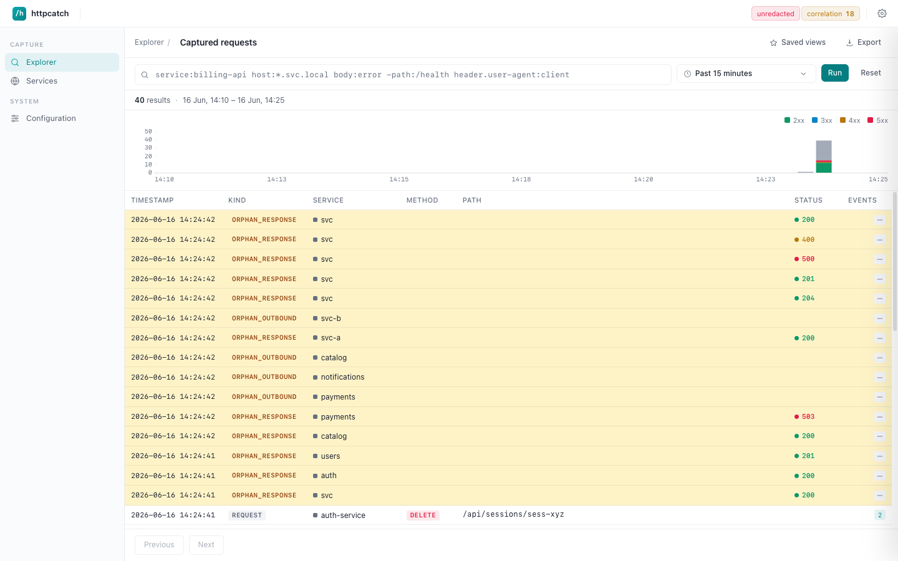
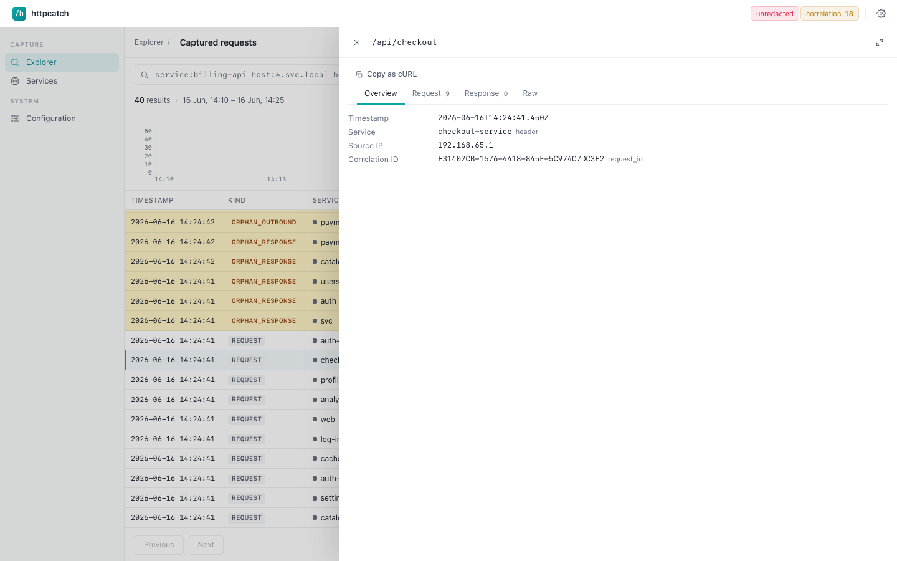
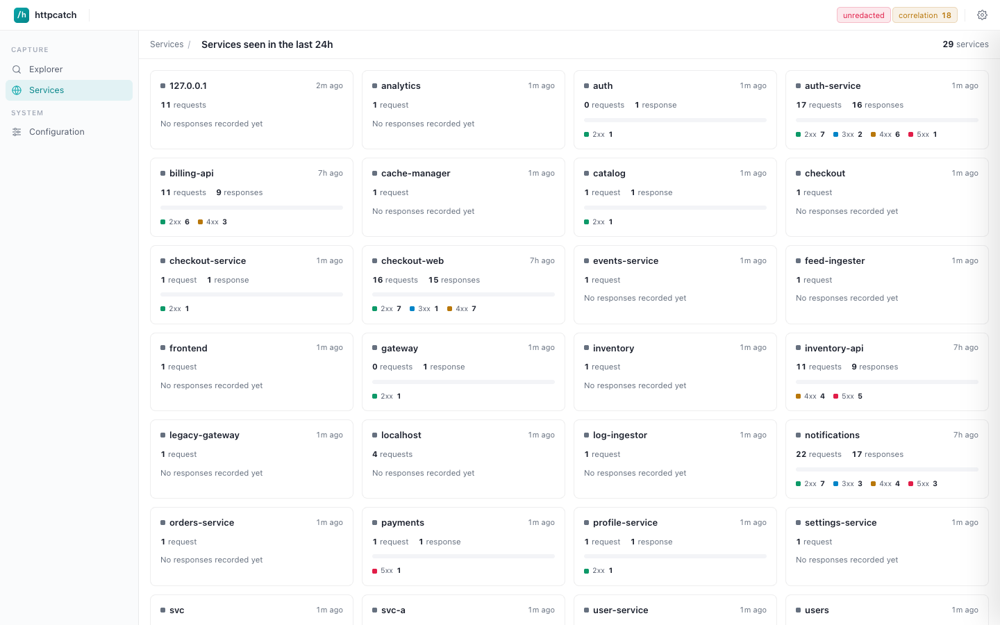
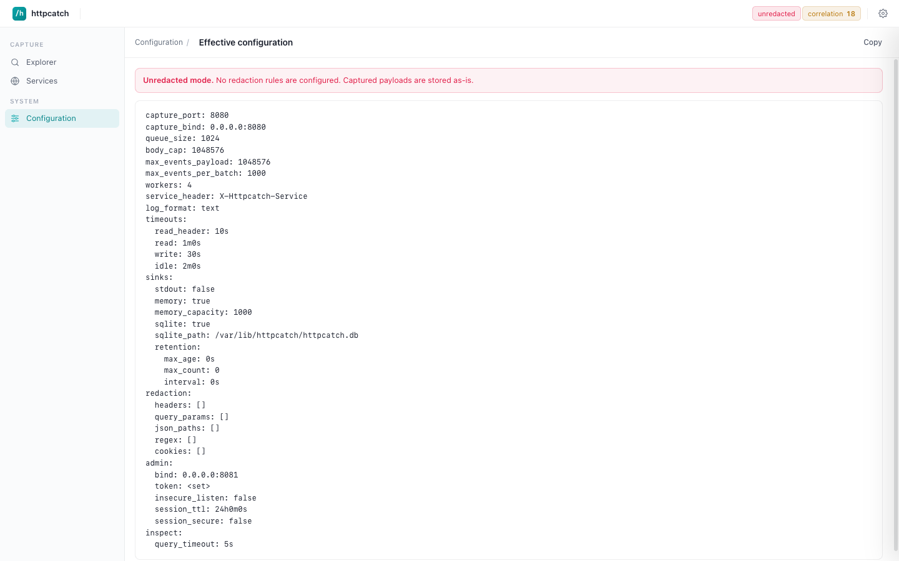

<div align="center">


# httpcatch

**A single-binary HTTP traffic capture and inspection tool.**

Receive mirrored HTTP traffic, redact sensitive data, store it, and inspect it
through an API and an embedded web UI.

[](https://github.com/radarnex/httpcatch/actions/workflows/ci.yml)
[](https://github.com/radarnex/httpcatch/releases)
[](LICENSE)
[](go.mod)

</div>

---

httpcatch sits at the receiving end of a traffic mirror. Your proxy (Traefik,
nginx, Envoy, …) mirrors requests to httpcatch's **capture port**; httpcatch
redacts them, fans them out to one or more storage **sinks**, and exposes a
searchable **inspect API** and web UI on a separate **admin port**. Apps can
also POST structured response/outbound events so a captured request and the work
it triggered show up correlated in one place.

It ships as one static binary with the UI embedded and SQLite for persistence —
no external services required.

## Features

- **Single binary, no dependencies.** Static Go binary with the web UI embedded
  and SQLite for storage. Nothing else to run.
- **Wire-level capture.** Any HTTP request that reaches the capture port is
  captured — no reserved paths, no client SDK. Point your proxy's mirror at it.
- **Asynchronous, bounded pipeline.** Requests are acked `202 Accepted` and
  drained by background workers. A bounded queue gives predictable memory and
  drops (counted, never blocking) under overload.
- **Pluggable sinks.** Fan out to any subset of `memory` (live-tail ring),
  `sqlite` (durable, indexed, with retention), and `stdout` (JSON stream for
  external consumers).
- **Built-in redaction.** Strip or mask secrets across headers, query params,
  JSON paths, regex matches, and cookies — applied once, before anything is
  stored. Validate rules offline with `httpcatch redact --test`.
- **Event correlation.** Apps POST `response` and `outbound` events that link
  back to a captured request via `traceparent` / `X-Request-ID`, so you see the
  inbound request and the downstream calls it made together.
- **Fast, expressive search.** Field-qualified and freeform terms, negation,
  and wildcards over indexed and scanned dimensions, from both the API and the
  UI search box.
- **Embedded web UI.** Browse, search, and inspect captured requests, events,
  and services from the admin port.
- **Observable.** Prometheus metrics on the admin port surface drops, orphans,
  and capture/correlation gaps.

## Architecture

```
   proxy / app                httpcatch
 ┌──────────────┐      ┌───────────────────────────────┐
 │  mirror  ────────▶  │  capture port (:8080)         │
 │              │      │     │  202 Accepted           │
 │  POST /events ───▶  │     ▼                         │
 └──────────────┘      │  capture queue (bounded)      │
                       │     │                         │
                       │     ▼  workers: redact        │
                       │  ┌───────────────────────┐    │
                       │  │ sinks: memory/sqlite/ │    │
                       │  │         stdout        │    │
                       │  └───────────────────────┘    │
                       │     │                         │
   operator  ◀───────────────┘                         │
 (UI + API)            │  admin port (:8081)           │
                       │  inspect API · UI · /metrics  │
                       └───────────────────────────────┘
```

- **Capture port** — the unauthenticated ingestion listener. Every request is
  treated as captured traffic. Keep it on a private network behind your proxy.
- **Capture pipeline** — requests are enqueued and acked immediately; workers
  redact and persist asynchronously. A full queue drops (and counts) rather
  than blocks. Worst-case in-flight memory ≈ `queue_size × body_cap`.
- **Sinks** — each enabled sink receives the same redacted payload. Memory is a
  bounded ring for live-tail; SQLite is the durable indexed store with
  retention; stdout is a JSON event stream.
- **Admin port** — separate authenticated listener for the inspect API, the
  embedded UI, health checks, and Prometheus metrics. Defaults to loopback.

For the deeper design rationale, see the
[architecture decision records](docs/adr/) and the
[threat model](docs/THREAT_MODEL.md).

## Getting started

### Docker

```bash
docker run --rm \
  -p 8080:8080 -p 127.0.0.1:8081:8081 \
  -e HTTPCATCH_ADMIN_TOKEN=changeme \
  ghcr.io/radarnex/httpcatch:latest
```

The capture port is on `:8080`, the admin UI on `http://127.0.0.1:8081`. Log in
with the admin token.

### Docker Compose

```yaml
services:
  httpcatch:
    image: ghcr.io/radarnex/httpcatch:latest
    ports:
      - "8080:8080"
      - "127.0.0.1:8081:8081"
    environment:
      HTTPCATCH_SINKS: "sqlite,memory"
      HTTPCATCH_SQLITE_PATH: "/var/lib/httpcatch/httpcatch.db"
      HTTPCATCH_ADMIN_BIND: "0.0.0.0:8081"
      HTTPCATCH_ADMIN_TOKEN: "changeme"
    volumes:
      - httpcatch-data:/var/lib/httpcatch
    restart: unless-stopped

volumes:
  httpcatch-data:
```

### Helm

The chart is published as an OCI artifact on GitHub Container Registry:

```bash
helm install httpcatch oci://ghcr.io/radarnex/charts/httpcatch \
  --set adminToken.value=changeme
```

See [`deploy/helm/httpcatch/values.yaml`](deploy/helm/httpcatch/values.yaml)
for the full set of configurable values (persistence, ingress, autoscaling,
ServiceMonitor, redaction, and more).

### Binary

Download a prebuilt archive for your platform from the
[releases page](https://github.com/radarnex/httpcatch/releases), then:

```bash
export HTTPCATCH_ADMIN_TOKEN=changeme
httpcatch serve --config httpcatch.yaml
```

### Build from source

```bash
make build        # -> bin/httpcatch
make run          # build and run
make check        # fmt + vet + lint + vuln + race tests
```

## Configuration

httpcatch is configured by an optional YAML file (`--config`) with environment
variable overrides (`HTTPCATCH_*`) that always take precedence. Start from the
annotated examples:

- [`examples/basic.yaml`](examples/basic.yaml) — ports, queue, sinks,
  retention, timeouts, admin.
- [`examples/redact.yaml`](examples/redact.yaml) — a comprehensive redaction
  ruleset for headers, query params, JSON paths, regex, and cookies.

Validate a redaction ruleset against a sample request without storing anything:

```bash
httpcatch redact --test --config httpcatch.yaml < sample-request.http
```

## Search

The inspect API (`GET /requests`) and the UI search box accept a
whitespace-separated list of terms, AND'd together, with `-` to negate:

```
service:api status:500 path:/v1/* -header.user-agent:bot
```

Terms are either field-qualified (`host:`, `path:`, `service:`, `body:`,
`headers:`, `header.<name>:`, `method:`, `status:`, `source_ip:`,
`correlation_id:`) or freeform (unioned over host/path/service and
request/event bodies and headers). `*` is a prefix/substring wildcard; quote a
term to match it verbatim. See [ADR-0004](docs/adr/0004-search-language.md) for
the full grammar.

## Screenshots

<div align="center">

#### Request list & search


#### Request detail


#### Services


#### Configuration


</div>

## Contributing & security

- Found a bug or want a feature? Open an
  [issue](https://github.com/radarnex/httpcatch/issues).
- Found a vulnerability? Please report it privately — see
  [SECURITY.md](SECURITY.md).

## License

Released under the [MIT License](LICENSE).
